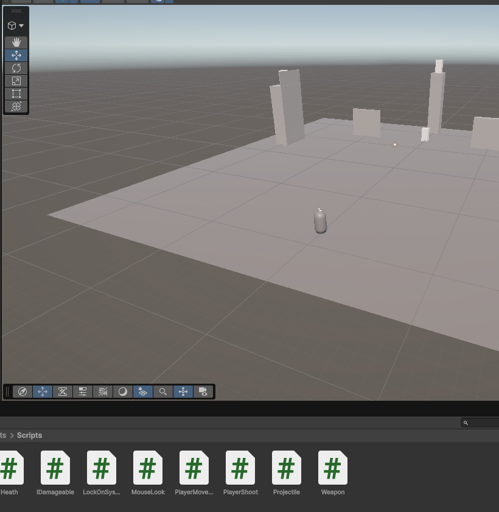
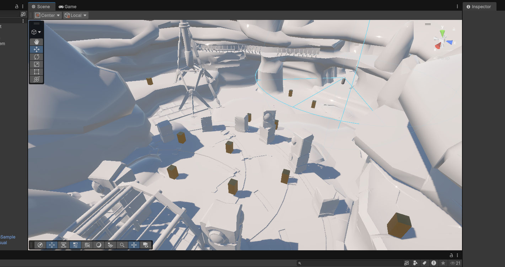
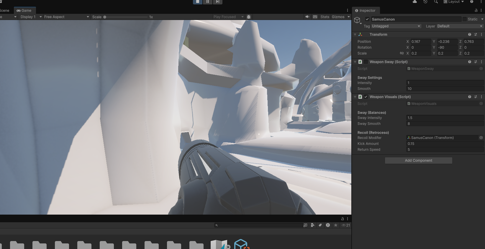
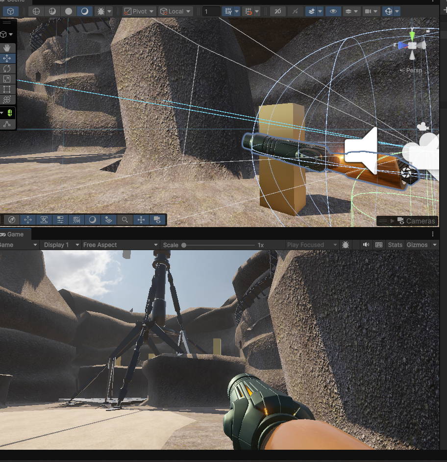
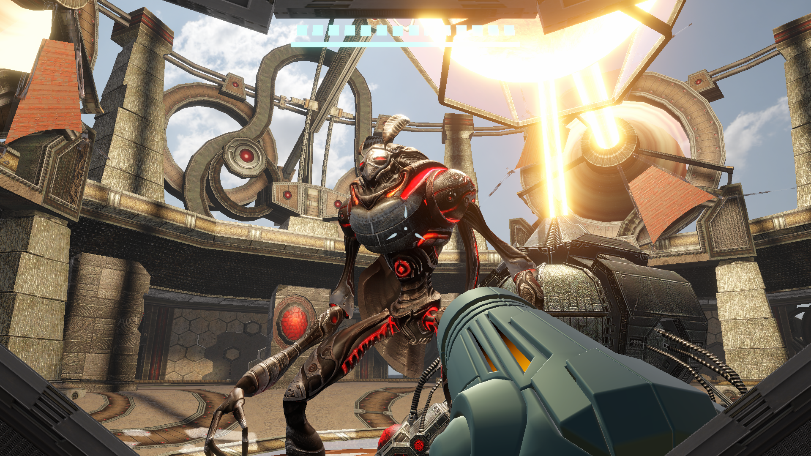
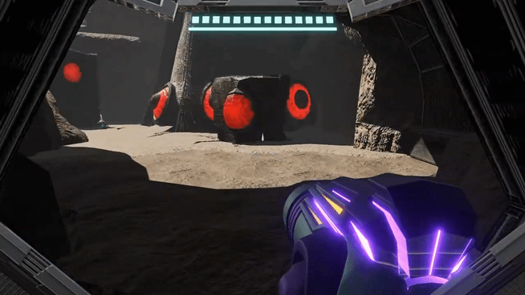
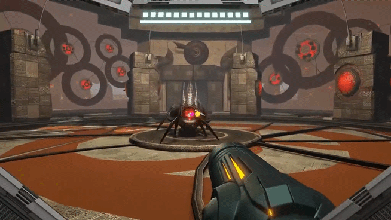

# Metroid Prime 2 Remaster (Fan Project)

> Fan remake desarrollado en Unity con fines educativos.

---

## 🎮 Descripción

Este proyecto es un remake/remaster desarrollado para aprender desarrollo de videojuegos utilizando Unity y C#.

El repositorio únicamente contiene el código fuente desarrollado por mí.

No incluye modelos 3D, texturas, audio ni otros recursos protegidos por derechos de autor.

---

## 📷 Capturas

### Inicio del Desarrollo

### Agregar enemigos

### Introducción del arma

### Ajustes

### Terminación

---

## 🎥 Gameplay

### Movimiento

### Combate

---

## 🛠 Tecnologías

- Unity
- C#
- Visual Studio
- Git

---

## ✨ Características

- Player Controller
- Cámara en primera persona
- HUD
- Animaciones Prosedurales
- Scripts personalizados

---

## 📺 Video

https://youtu.be/gfb3O5M-GZ4?si=O0ja2jL6YmCsIo3o

---

## 📚 Lo que aprendí

- Organización de scripts
- Arquitectura básica en Unity
- Control de cámaras
- Optimización

---

## ⚠️ Aviso

Este proyecto fue desarrollado únicamente con fines educativos.

No pretende distribuir contenido protegido por Nintendo.
