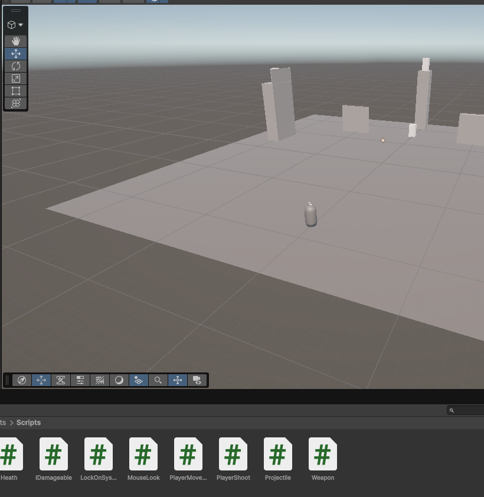
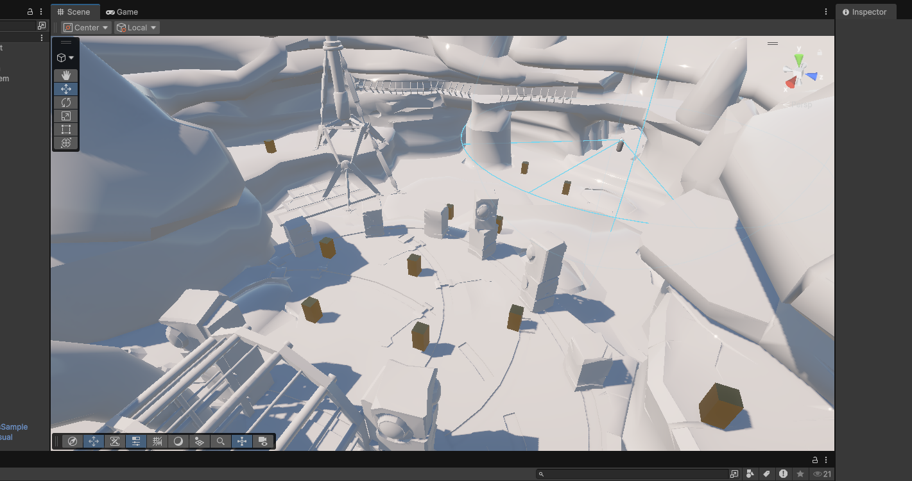
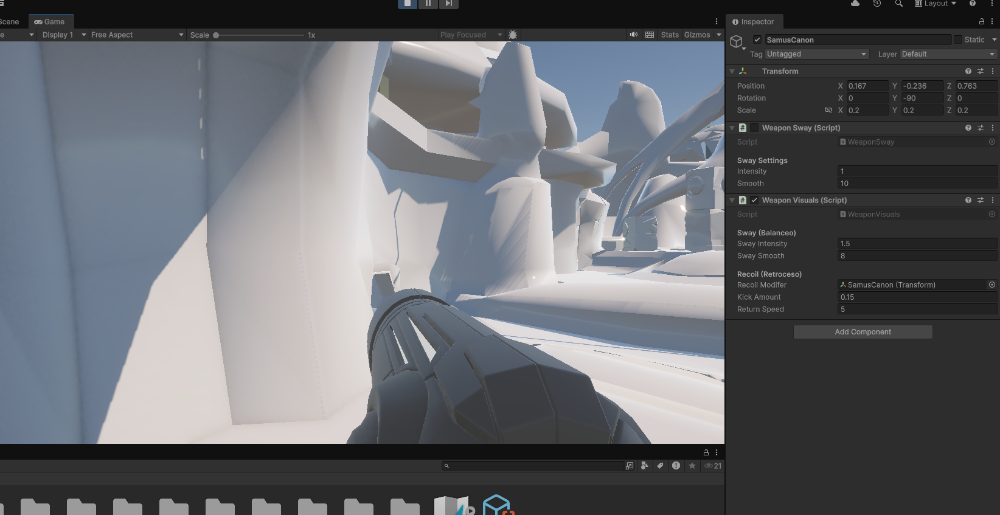
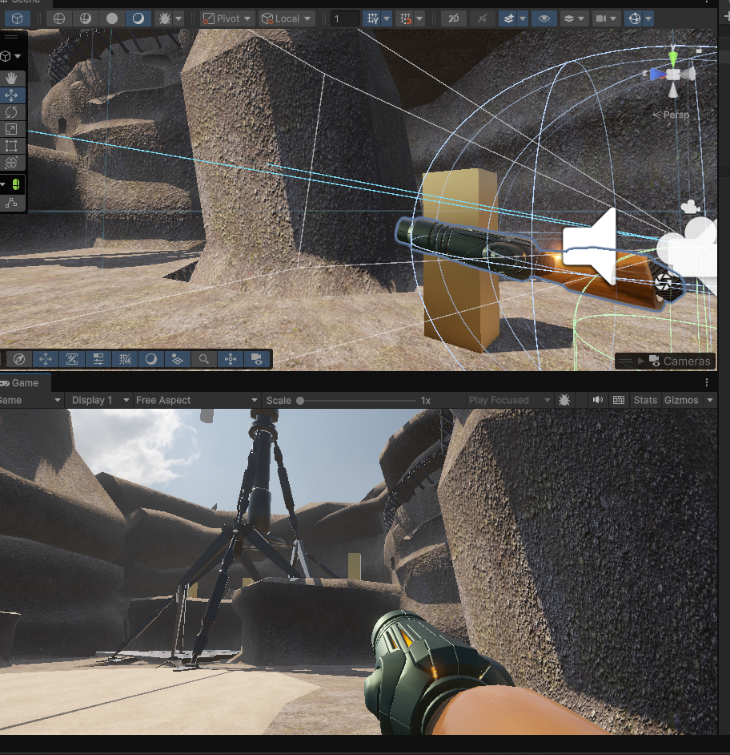
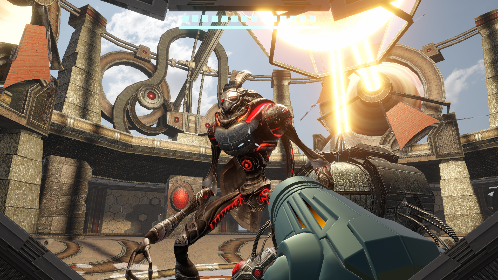
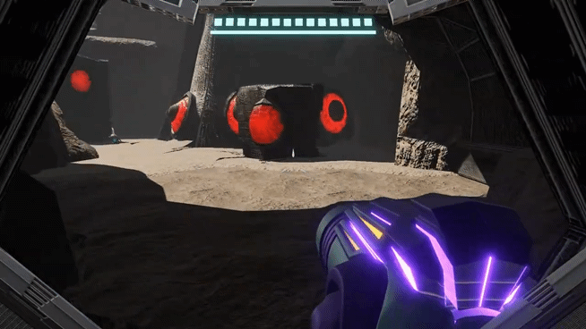
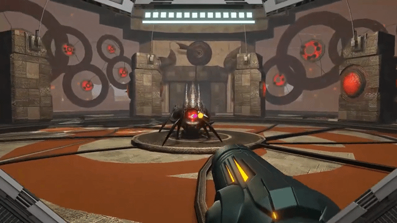

# 🌌 Metroid Prime 2: Echoes Remastered (Prototype)

> **A passion project and two-month learning experiment built in Unity.**

  <a href="#description">Description</a> •
  <a href="#technical-features">Features</a> •
  <a href="#screenshots">Screenshots</a> •
  <a href="#gameplay">Gameplay</a> •
  <a href="#video">Video</a> •
  <a href="#credits">Credits</a>

---

## Description

This is a prototype and learning exercise that aims to recreate the mechanics and atmosphere of **Metroid Prime 2: Echoes**. It was built entirely in Unity with C# over the course of two months and served as a technical experiment.

> [!NOTE]
> **Repository note:** This repository contains only the source code and scripts I wrote. It does not include any 3D models, textures, audio, or other copyrighted assets.

---

## Technical Features

| Component | What's Implemented |
| :--- | :--- |
| **Player Controller** | Smooth first-person movement that mimics the physics of the original game. |
| **Animation** | Procedural animation systems for the arm cannon and weapon transitions. |
| **Camera** | Camera and perspective control. |
| **Architecture** | Modular C# script structure. |

---

## Screenshots

### Development Process
<table align="center">
  <tr>
    <td align="center" width="50%">
      <b>1. Starting development</b>  
      
    </td>
    <td align="center" width="50%">
      <b>2. Adding enemies</b>  
      
    </td>
  </tr>
  <tr>
    <td align="center" width="50%">
      <b>3. Introducing the weapon</b>  
      
    </td>
    <td align="center" width="50%">
      <b>4. Tweaks and polish</b>  
      
    </td>
  </tr>
</table>

 

### Final Result

  
<b>5. Finished prototype</b>

  

---

## Gameplay

### Movement

  

### Combat

  

---

## Video

You can watch the full prototype in action on YouTube:

  <a href="https://youtu.be/gfb3O5M-GZ4?si=O0ja2jL6YmCsIo3o">
    ▶️ Watch the prototype on YouTube
  </a>

---

## Key Takeaways

- **Clean architecture:** Designing and organizing scripts in a clear, structured way in Unity.
- **Game feel:** Fine-tuning character controls to get a responsive, satisfying feel.
- **Optimization:** Managing resources efficiently and keeping update logic lean within the engine.

---

## Credits

Special thanks to the creators of the community assets used in this experiment:
* **Samus's Arm Cannon model:** DorianFillatre
* **Additional models:** jameslucino117
* **Inspiration:** Nintendo's incredible *Metroid* series. ❤️

---

## ⚠️ Disclaimer

This project was developed **solely for educational and technical demonstration purposes**, out of love for the series and this game in particular. It is a non-commercial, not-for-profit fan project and does not intend to distribute or infringe on any intellectual property owned by Nintendo. It will not receive further updates.
